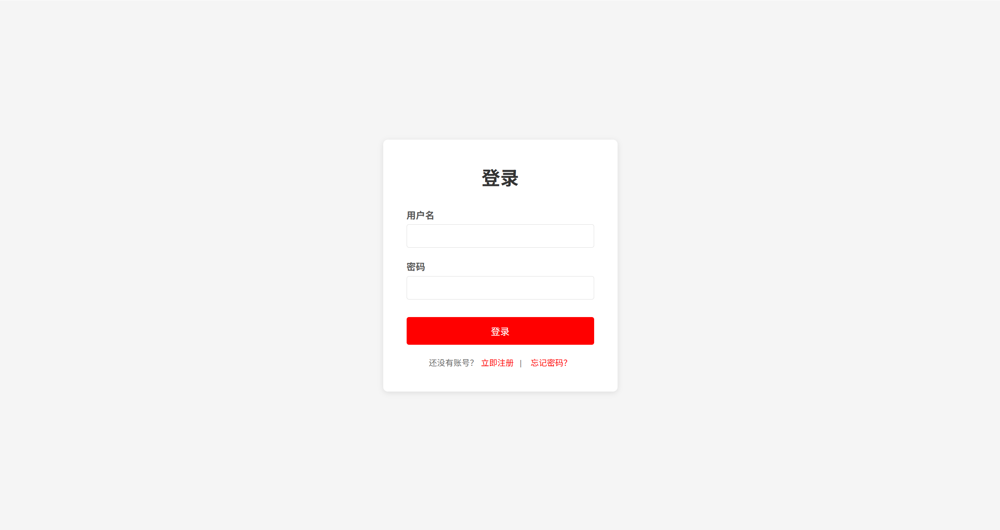
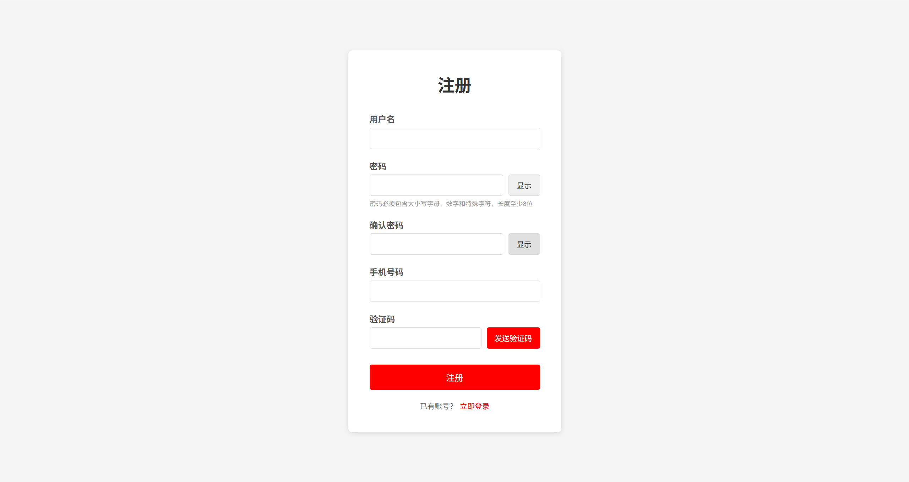
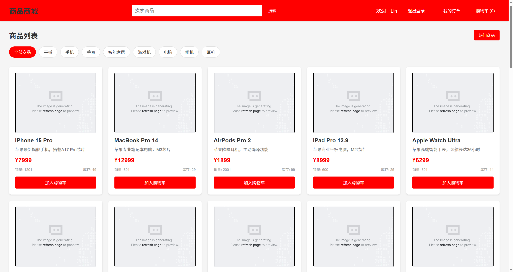
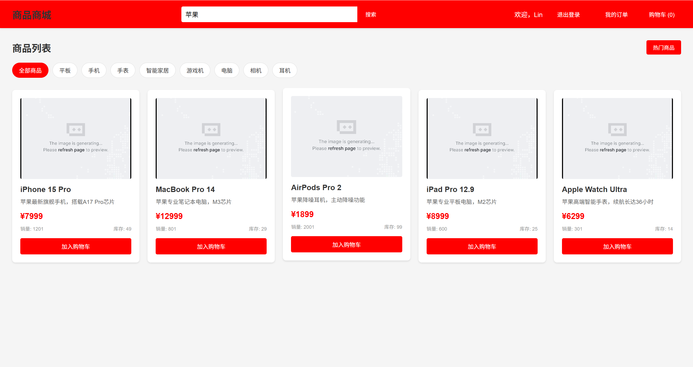

# 商城管理系统

一个基于 Spring Boot + Vue3 的全栈商城项目，包含商品增删改查、热门推荐、搜索等功能。









## 技术栈

### 后端
- **Spring Boot 3.2.0** - 核心框架
- **Spring Data JPA** - 数据持久层
- **H2 Database** - 内存数据库（开发测试用）
- **Lombok** - 简化代码
- **Maven** - 构建工具

### 前端
- **Vue 3.4** - 前端框架
- **TypeScript** - 类型支持
- **Vite** - 构建工具
- **Element Plus** - UI组件库
- **Pinia** - 状态管理
- **Vue Router** - 路由管理
- **Axios** - HTTP客户端

## 项目结构

```
mall-project/
├── backend/                 # Spring Boot 后端项目
│   ├── src/main/java/com/mall/
│   │   ├── config/         # 配置类
│   │   ├── controller/     # 控制器
│   │   ├── dto/            # 数据传输对象
│   │   ├── entity/         # 实体类
│   │   ├── repository/     # 数据访问层
│   │   ├── service/        # 业务逻辑层
│   │   └── MallApplication.java
│   ├── src/main/resources/
│   │   └── application.yml
│   └── pom.xml
├── frontend/               # Vue3 前端项目
│   ├── src/
│   │   ├── api/           # API接口
│   │   ├── components/    # 组件
│   │   ├── router/        # 路由配置
│   │   ├── stores/        # Pinia状态管理
│   │   ├── types/         # TypeScript类型
│   │   ├── utils/         # 工具函数
│   │   ├── views/         # 页面视图
│   │   ├── App.vue
│   │   └── main.ts
│   ├── package.json
│   ├── vite.config.ts
│   └── tsconfig.json
└── README.md
```

## 功能特性

### 商品管理
- ✅ 商品列表展示（分页）
- ✅ 添加商品
- ✅ 编辑商品
- ✅ 删除商品
- ✅ 商品详情查看

### 搜索功能
- ✅ 关键字搜索
- ✅ 分类筛选
- ✅ 价格区间筛选
- ✅ 高级搜索组合条件

### 热门推荐
- ✅ 热门商品列表
- ✅ 销量排行榜
- ✅ 热门商品统计
- ✅ 设置/取消热门状态

### 其他功能
- ✅ 响应式布局
- ✅ 数据统计面板
- ✅ 图片预览
- ✅ 表单验证

## 快速开始

### 1. 克隆项目

```bash
git clone <repository-url>
cd mall-project
```

### 2. 启动后端

```bash
cd backend
mvn clean install
mvn spring-boot:run
```

后端服务将启动在 `http://localhost:8080`

### 3. 启动前端

```bash
cd frontend
npm install
npm run dev
```

前端服务将启动在 `http://localhost:3000`

### 4. 访问应用

打开浏览器访问 `http://localhost:3000`

## API 接口文档

### 商品相关接口

| 方法 | 路径 | 描述 |
|------|------|------|
| GET | /api/products | 获取商品列表（分页） |
| GET | /api/products/{id} | 根据ID获取商品 |
| POST | /api/products | 添加商品 |
| PUT | /api/products/{id} | 更新商品 |
| DELETE | /api/products/{id} | 删除商品 |
| GET | /api/products/search | 搜索商品 |
| GET | /api/products/advanced-search | 高级搜索 |
| GET | /api/products/hot | 获取热门商品 |
| GET | /api/products/hot/page | 分页获取热门商品 |
| GET | /api/products/category/{category} | 根据分类获取商品 |
| PUT | /api/products/{id}/hot | 设置热门状态 |
| POST | /api/products/{id}/sales | 增加销量 |

## 数据库配置

项目默认使用 H2 内存数据库，方便开发和测试。如需切换到 MySQL，请修改 `application.yml`：

```yaml
spring:
  datasource:
    url: jdbc:mysql://localhost:3306/mall_db?useUnicode=true&characterEncoding=utf-8
    username: root
    password: your_password
    driver-class-name: com.mysql.cj.jdbc.Driver
  jpa:
    hibernate:
      ddl-auto: update
    database-platform: org.hibernate.dialect.MySQLDialect
```

## 页面截图

### 首页
- 数据统计面板
- 热门商品展示
- 最新上架商品
- 快捷操作入口

### 商品管理
- 商品列表（分页）
- 搜索功能
- 增删改查操作
- 热门状态设置

### 热门推荐
- 热门商品排行
- 销量统计
- 商品卡片展示

### 商品搜索
- 关键字搜索
- 分类筛选
- 价格区间筛选
- 热门搜索标签

## 开发计划

- [ ] 用户认证与授权
- [ ] 购物车功能
- [ ] 订单管理
- [ ] 支付集成
- [ ] 图片上传功能
- [ ] 数据导出
- [ ] 系统日志

## 贡献指南

1. Fork 本仓库
2. 创建特性分支 (`git checkout -b feature/AmazingFeature`)
3. 提交更改 (`git commit -m 'Add some AmazingFeature'`)
4. 推送到分支 (`git push origin feature/AmazingFeature`)
5. 创建 Pull Request

## 许可证

本项目基于 MIT 许可证开源。

## 联系方式

如有问题或建议，欢迎提交 Issue 或 Pull Request。
